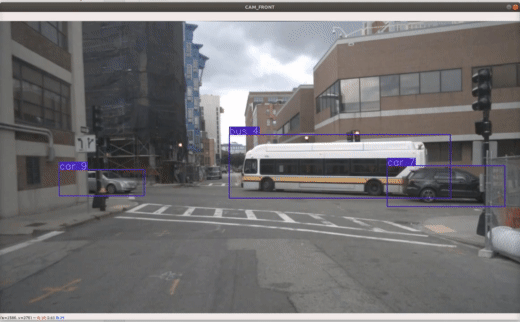

# Multi-Object Tracking with Poisson Multi-Bernoulli Mixture (PMBM) Filter
This repo contains by implementation of PMBM filter for multi-object tracking in the setting of NuScenes Dataset. This 
is a part of my Master thesis at École Centrale de Nantes.

## Quantitative Result
The following table compares the performance of PMBM filter against the NuScenes Tracking Challenge's baseline 
[AB3DMOT](https://github.com/xinshuoweng/AB3DMOT) and the tracker that win the challenge in 2019 
[StanfordIPRL-TRI](https://github.com/eddyhkchiu/mahalanobis_3d_multi_object_tracking) in term of per-class and overall
AMOTA. All three trackers under comparison here use [MEGVII](https://github.com/poodarchu/Det3D) as object detections.
The validation split of NuScenes is used for comparison.

Method | Overall | bicycle | bus | car | motorcycle | pedestrian | trailer | truck
---------- | --: | --: | --: | --: | --: | --: | --: | --: 
AB3DMOT                         | 17.9 |  0.9 | 48.9 | 36.0 |  5.1 |  9.1 | 11.1 | 14.2
StanfordIPRL-TRI                | 56.1 | 27.2 | 74.1 | 73.5 | 50.6 | 75.5 | 33.7 | 58.0
**PMBM-MEGVII**                 | 57.4 | 22.8 | 73.9 | 76.7 | 58.2 | 75.3 | 36.7 | 58.2

Like StanfordIPRL-TRI, PMBM filer significantly improves AMOTA of every class of objects compared to the baseline.

Since [MEGVII](https://github.com/poodarchu/Det3D), there is a number of advancements made to object detection. Exploiting
the high quality detcetion of [CenterPoint](https://github.com/tianweiy/CenterPoint) which is currently the best object detector
in NuScenes Detection Challenge, [CenterTrack](https://github.com/xingyizhou/CenterTrack) outperforms the rest in Nuscenes
Tracking Challenge. The comparisons between PMBM using CenterPoint as object detector and CenterTrack is shown below

Method | Overall | bicycle | bus | car | motorcycle | pedestrian | trailer | truck
---------- | --: | --: | --: | --: | --: | --: | --: | --: 
CenterTrack                     | 65.0 | 33.1 | 71.5 | 81.8 | 58.7 | 78.0 | 69.3 | 62.5
**PMBM-CenterPoint**            | 62.6 | 30.5 | 68.8 | 78.5 | 60.5 | 76.8 | 65.9 | 57.5

## Qualitative Result
The demonstration of multi-object tracking in scene 0757 of the NuScenes dataset is shown below. This figure shows the 
multi-object tracking in 3D projected onto CAM_FRONT image.

 
 
## Using This Repo

### Installation
First, clone the repository containing a Python wrapper for implementation of Murty's algorithm

```
git clone --recursive git@github.com:erikbohnsack/murty.git
```

**Before building** this wrapper, comment out line 5 to line 8 of CMakeLists.txt. Next, in the `murty` directory (that 
is just cloned)

```
mkdir build
cd build
cmake ..
make
```

A `.so` file will be created. (for me this file named: murty.cpython-36m-x86_64-linux-gnu). 

Clone this repo

```
git clone https://github.com/quan-dao/pmbm-filter
```

Then copy the `.so` file created previously to `pmbm-filter` directory. Finally, install NuScenes devkit

```
git clone https://github.com/nutonomy/nuscenes-devkit.git
cd nuscenes-devkit
pip install -r setup/requirements.txt
```

### Tracking In 1 Scene
This is to create a demonstration of tracking in one scene of NuScenes. First, extract all object detection of this scene
by executing the notebook `notebook/nuscenes_get_true_detection_measurement.ipynb`. This notebook will read the detection
file (the default is [MEGVII's detection](https://www.nuscenes.org/data/detection-megvii.zip)) and extract all detection
in the scene of interest, then store it as a json file in the directory `scene-detection`. If you don't want to run this 
notebook, there is one detection file for scene 0757 in `scene-detection`.

Second, run PMBM on this scene

```
python nuscenes_tracking_pmbm.py ----detection_file fixed-megvii-measurement-full-scene-0757.json
```

The result of the second step is a file in folder `estimation-result` contains the tracking result at every time step 
of scene 0757 . Finally, visualize tracking result

```
python visualization/render_tracking_result.py --version v1.0-mini --dataroot full_path_NuScenes_directory 
--estimation_file estimation-scene-0757-20200709-123722.json --scene_name scene-0757
``` 
Press `space` to pause the visualization or `Esc` to exit.

### Tracking In Test Set
First, download CenterPoint detection file for NuScene Test set at https://drive.google.com/file/d/1GJzIBJKxg4NVFXF0SeBzmrL87ALuIEx0/view?usp=sharing

Next, execute the notebook `notebook/unzip_CenterTrack_detection.ipynb`. This notebook will fill the directory `centerPoint-per-scene-detection`
will 150 json files each file contains all the detection of the scene whose token is the file name.

Finally, run PMBM on the whole test set

```
python nuscenes_tracking_pmbm_full_speed_up.py
```

This can take up to 45 minutes.
